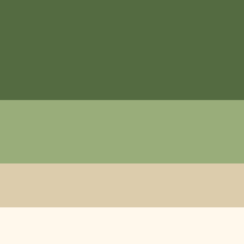

# vidgen

Generates synthetic test videos with animated gradient backgrounds and a text overlay.

## Requirements

- Python 3.x
- FFmpeg (must be on `PATH`)

```bash
python -m venv .venv
.venv/bin/pip install -r requirements.txt
```

## Usage

```bash
.venv/bin/python vidgen.py               # all defaults → auto-named output file
.venv/bin/python vidgen.py -c config.json
```

The only CLI option is `-c`/`--config`, pointing to a JSON file. All keys are optional — missing or `null` values fall back to defaults. See `sample.json` for a ready-to-copy template.

## Config reference

| Key | Type | Default | Description |
|---|---|---|---|
| `output` | string\|null | `null` | Output path. If `null`, auto-named `{res}_{fps}fps_{bitrate}bps_{duration}s.{ext}` where ext is inferred from codec. |
| `resolution` | string | `"1920x1080"` | Frame size as `WxH`. |
| `framerate` | int | `24` | Frames per second. |
| `bitrate` | string | `"8M"` | Video bitrate (`"500k"`, `"4M"`, etc.). |
| `codec` | string | `"libx264"` | FFmpeg video codec. See codec table below. |
| `duration` | float | `30` | Length in seconds. |
| `text` | string\|null | `null` | Static text overlay. If `null`, shows video metadata (resolution, fps, format, codec, duration). |
| `font_size` | int\|null | `null` | Font size in pixels. If `null`, auto-scaled to `height / 12` (e.g. 60px at 720p). |
| `font_color` | string | `"black"` | Text color — HTML name or `#RRGGBB`. |
| `gradient_type` | string | `"linear"` | One of: `linear`, `radial`, `circular`, `spiral`, `square`. |
| `linear_angle` | float | `0` | Rotation of the `linear` gradient in degrees (0 = horizontal, 90 = vertical). Has no effect on other gradient types. |
| `colors` | string[] | pastel palette¹ | List of hex color strings (without `#`). |
| `nb_colors` | int | `4` | How many colors to use from `colors`. Cycles if fewer than requested. |
| `speed` | float | `0.08` | Animation speed in color-cycles per second. |
| `seed` | — | `null` | Reserved, currently unused. |

¹ Default palette: `546B41`, `99AD7A`, `DCCCAC`, `FFF8EC`


### Gradient types

| Type | Shape | Animation |
|---|---|---|
| `linear` | Parallel color bands | Bands slide along the gradient slope |
| `radial` | Soft rings from center | Rings expand outward |
| `circular` | Tighter concentric rings | Rings expand outward (3× frequency) |
| `spiral` | Archimedean spiral | Spiral rotates around center |
| `square` | Concentric rectangles | Rectangles expand outward |

### Codec → container mapping

| Codec | Container | Extension |
|---|---|---|
| `libx264`, `libx265`, `h264`, `hevc` | MP4 | `.mp4` |
| `libvpx-vp9`, `libvpx`, `vp9`, `vp8` | WebM | `.webm` |
| `libaom-av1`, `av1` | Matroska | `.mkv` |
| `prores`, `prores_ks` | QuickTime | `.mov` |
| `dnxhd` | MXF | `.mxf` |
| `huffyuv`, `rawvideo` | AVI | `.avi` |
| *(any other)* | MP4 | `.mp4` |

## How it works

Each frame is generated in Python using **numpy** (vectorized gradient math) and **Pillow** (image + text rendering), then piped as raw RGB24 bytes to **FFmpeg** for encoding. The gradient phase map is precomputed once; per frame only a scalar offset is added — making generation fast regardless of resolution. Frames are rendered in parallel using a thread pool (up to 30 frames ahead) to saturate available CPU cores.

The font (NotoSans) is bundled in `fonts/` and requires no system installation.
