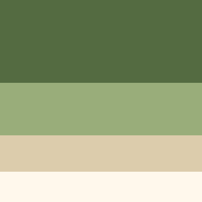

# vidgen

Generates synthetic test videos with animated gradient backgrounds and a text
overlay.

> [!IMPORTANT]
> This branch is under a re-write in Go.

## Requirements

- Go 1.26+
- FFmpeg (must be on `PATH`)

## Usage

```bash
go run .                # all defaults
go run . -c config.json # load config from file
```

The only CLI option is `-c`/`--config`, pointing to a JSON file. All keys are
optional — missing or `null` values fall back to defaults. See `sample.json`
for a ready-to-copy template.

## Config reference

| Key             | Type         | Default         | Description                                                                                                                            |
| --------------- | ------------ | --------------- | -------------------------------------------------------------------------------------------------------------------------------------- |
| `output`        | string\|null | `null`          | Output path. If `null`, auto-named `{gradient_type}_{res}_{fps}fps_{bitrate}bps_{duration}s.{ext}`¹ where ext is inferred from codec.* |
| `resolution`    | string       | `"1920x1080"`   | Frame size as `WxH`.                                                                                                                   |
| `framerate`     | int          | `24`            | Frames per second.                                                                                                                     |
| `bitrate`       | int          | `2097152`       | Video bitrate in bits per second.                                                                                                      |
| `codec`         | string       | `"libx264"`     | FFmpeg video codec. See codec table below.                                                                                             |
| `duration`      | int          | `30`            | Length in seconds.                                                                                                                     |
| `text`          | string\|null | `null`          | Static text overlay. If `null`, shows video metadata (resolution, fps, format, codec, duration).                                       |
| `font_size`     | int\|null    | `null`          | Font size in pixels. If `null`, auto-scaled to `height / 12` (e.g. 60px at 720p).                                                      |
| `font_color`    | string       | `"black"`       | Text color — HTML name or `#RRGGBB`.                                                                                                   |
| `gradient_type` | string       | `"radial"`      | One of: `linear`, `radial`, `circular`, `spiral`, `square`. Only `radial` is implemented so far.                                       |
| `linear_angle`  | float        | `0`             | Rotation of the `linear` gradient in degrees (0 = horizontal, 90 = vertical). Has no effect on other gradient types.                   |
| `colors`        | string[]     | pastel palette² | List of hex color strings (without `#`).                                                                                               |
| `nb_colors`     | int          | `4`             | How many colors to use from `colors`. Cycles if fewer than requested.                                                                  |
| `speed`         | float        | `0.08`          | Animation speed in color-cycles per second.                                                                                            |
| `seed`          | —            | `null`          | Reserved, currently unused.                                                                                                            |

¹ Environment variables and shell metacharacters characters are expanded if a
value is specified. If the value points to a directory that exists on the
system, the file is created inside that directory using the auto-generated
path.

² Default palette: `546B41`, `99AD7A`, `DCCCAC`, `FFF8EC`



### Gradient types

| Type       | Shape                    | Animation                            |
| ---------- | ------------------------ | ------------------------------------ |
| `linear`   | Parallel color bands     | Bands slide along the gradient slope |
| `radial`   | Soft rings from center   | Rings expand outward                 |
| `circular` | Tighter concentric rings | Rings expand outward (3× frequency)  |
| `spiral`   | Archimedean spiral       | Spiral rotates around center         |
| `square`   | Concentric rectangles    | Rectangles expand outward            |

### Codec → container mapping

| Codec                                                                                                                                                                                                             | Container | Extension |
| ----------------------------------------------------------------------------------------------------------------------------------------------------------------------------------------------------------------- | --------- | --------- |
| `libx264`, `libx265`, `h264_nvenc`, `h264_amf`, `h264_qsv`, `h264_videotoolbox`, `hevc_nvenc`, `hevc_amf`, `hevc_qsv`, `hevc_videotoolbox`, `libaom-av1`, `libsvtav1`, `av1_nvenc`, `av1_amf`, `av1_qsv`, `mpeg4` | MP4       | `.mp4`    |
| `libvpx`, `libvpx-vp9`, `vp9_qsv`                                                                                                                                                                                 | WebM      | `.webm`   |
| `mpeg2video`, `mpeg2_qsv`                                                                                                                                                                                         | MPEG-PS   | `.mpg`    |
| `libxvid`, `mjpeg`, `mjpeg_qsv`                                                                                                                                                                                   | AVI       | `.avi`    |
| `prores`, `prores_ks`                                                                                                                                                                                             | QuickTime | `.mov`    |
| `dnxhd`                                                                                                                                                                                                           | MXF       | `.mxf`    |
| `libtheora`                                                                                                                                                                                                       | Ogg       | `.ogv`    |
| `libwebp`, `libwebp_anim`                                                                                                                                                                                         | WebP      | `.webp`   |

Unknown codecs are rejected at config load.

## How it works

Each frame is generated in Python using **numpy** (vectorized gradient math)
and **Pillow** (image + text rendering), then piped as raw RGB24 bytes to
**FFmpeg** for encoding. The gradient phase map is precomputed once; per frame
only a scalar offset is added — making generation fast regardless of
resolution. Frames are rendered in parallel using a thread pool (up to 30
frames ahead) to saturate available CPU cores.

The font (NotoSans) is bundled in `fonts/` and requires no system installation.
